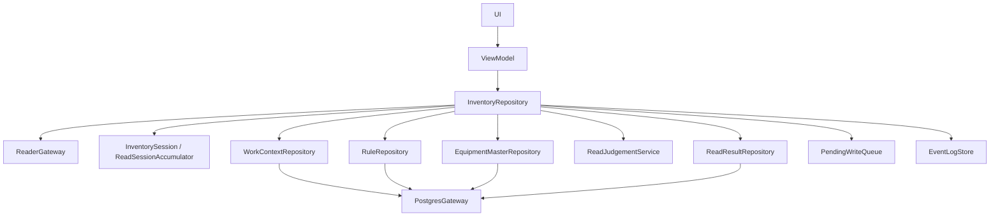

# 責務分離の叩き台

## 現状の集中点

`DefaultInventoryRepository` は UI 互換の facade として残している。Phase 2 では、work context / rule / equipment 取得、端末内判定、登録 bundle 生成を専用契約へ分離した。

まだ reader event 購読、repository state 更新、log 集約、pending write retry の順序制御は `DefaultInventoryRepository` に残している。これは UI 互換を保つための一時的な orchestration 責務であり、SQL や判定ルール本体は持たせない。

## 目標の依存方向

依存は UI から lower layer へ一方向に流す。PostgreSQL の詳細は `PostgresGateway` と data 実装へ閉じ込め、UI / ViewModel / domain service に SQL や table 名を出さない。

## 分割候補

| 候補 | 役割 | 今回の扱い |
| --- | --- | --- |
| `WorkContextRepository` | 作業対象を PostgreSQL から取得する | contract と fake 実装、Postgres adapter を追加 |
| `RuleRepository` | 帳票ルール bundle を取得する | contract と fake 実装、Postgres adapter を追加 |
| `EquipmentMasterRepository` | 設備マスタ snapshot を取得する | contract と fake 実装、Postgres adapter を追加 |
| `ReadSessionAccumulator` | session 内重複除去を担当する | 既存 `InventorySession` を後続 rename 候補にする |
| `ReadJudgementService` | Android 端末内判定を行う | 最小実装 `SimpleReadJudgementService` を追加 |
| `ReadResultBundleFactory` | 判定済み session snapshot を登録 bundle に変換する | `DefaultReadResultBundleFactory` を追加 |
| `ReadResultRepository` | 判定済み読取結果を PostgreSQL function へ登録する | rename 済み |
| `PendingWriteQueue` | 登録失敗 bundle を保留し再実行する | rename 済み |
| `PostgresGateway` | View / Function 呼び出しの低レベル境界 | `JdbcPostgresGateway`、設定、mapper、error mapper、repository adapter を追加 |
| `EventLogStore` | 構造化ログの保持 | 既存契約を維持 |

## 次段階で分割する順番

1. PostgreSQL 側の View / Function row contract と JSON schema を確定する。
2. 実 DB smoke test 用の接続設定注入方法を決める。
3. 帳票別ルールを `SimpleReadJudgementService` から専用判定実装へ置き換える。
4. `PendingWriteQueue` を Room などへ差し替え、登録失敗 bundle を再起動後も保持する。
5. `InventorySession` の責務名が読取 session accumulation として固まったら、`ReadSessionAccumulator` への rename を検討する。

## 今回見送ること

- live PostgreSQL 環境での接続検証。
- SQL / View / Function の最終名確定。
- `InventorySession` の rename。
- 帳票別の端末内判定ルール本実装。
