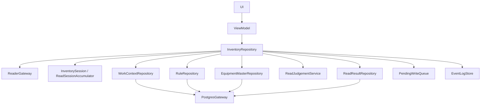

# 責務分離の叩き台

## 現状の集中点

`DefaultInventoryRepository` は現在、reader event、session 内重複除去、結果登録、pending write、structured log を束ねている。UI から見る境界としては機能しているが、rule/master 取得と端末内判定が入ると責務が広がる。

## 目標の依存方向

依存は UI から lower layer へ一方向に流す。PostgreSQL の詳細は `PostgresGateway` と data 実装へ閉じ込め、UI / ViewModel / domain service に SQL や table 名を出さない。

## 分割候補

| 候補 | 役割 | 今回の扱い |
| --- | --- | --- |
| `WorkContextRepository` | 作業対象を PostgreSQL から取得する | placeholder interface を追加 |
| `RuleRepository` | 帳票ルール bundle を取得する | placeholder interface を追加 |
| `EquipmentMasterRepository` | 設備マスタ snapshot を取得する | placeholder interface を追加 |
| `ReadSessionAccumulator` | session 内重複除去を担当する | 既存 `InventorySession` を後続 rename 候補にする |
| `ReadJudgementService` | Android 端末内判定を行う | placeholder interface を追加 |
| `ReadResultRepository` | 判定済み読取結果を PostgreSQL function へ登録する | rename 済み |
| `PendingWriteQueue` | 登録失敗 bundle を保留し再実行する | rename 済み |
| `PostgresGateway` | View / Function 呼び出しの低レベル境界 | placeholder interface を追加 |
| `EventLogStore` | 構造化ログの保持 | 既存契約を維持 |

## 次段階で分割する順番

1. `DefaultInventoryRepository` に work context / rule / equipment 取得を直接増やさず、専用 repository を注入する。
2. `ReadJudgementService` を純粋関数として実装し、Android / PostgreSQL / RP902 SDK に依存させない。
3. `ReadResultRepository` の実装で PostgreSQL function を呼ぶ。table 直叩きはしない。
4. `PendingWriteQueue` を Room などへ差し替え、登録失敗 bundle を再起動後も保持する。
5. `InventorySession` の責務が読取 session accumulation として固まったら、`ReadSessionAccumulator` への rename を検討する。

## 今回見送ること

- PostgreSQL 実接続コードの実装。
- SQL / View / Function の具体名確定。
- `DefaultInventoryRepository` の大規模分割。
- `InventorySession` の rename。
- 端末内判定ルールの本実装。
