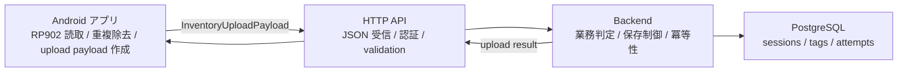

# 00 概要

この資料群は、RP902 Android アプリと backend / PostgreSQL をつなぐための引き継ぎ資料です。サーバー担当者が「何を受け取るのか」「何を自由に設計してよいのか」「何はアプリ側と合意しないと危険か」を判断できることを目的にしています。

## このアプリがサーバーに期待していること

| 区分 | 内容 |
| --- | --- |
| 確定 | アプリは inventory session 単位で EPC 読取結果を upload する設計です。 |
| 確定 | 同一 session 内の同一 EPC はアプリ側で 1 件にまとめ、`readCount` を増やします。 |
| 確定 | 現在の `Upload completed` は本物サーバー送信成功ではなく、`FakeUploadRepository` による仮実装の成功表示です。 |
| 提案 | アプリから PostgreSQL へ直接接続せず、`アプリ -> API -> サーバー -> PostgreSQL` にします。 |
| 未定 | 本番 API endpoint、認証方式、最終 JSON schema、業務判定内容は未確定です。 |

## サーバー担当者が最初に理解すべきこと

1. アプリは RFID の読取と session payload 作成を担当します。
2. backend は保存、業務判定、master data 照合、監査、最終ステータス管理を担当します。
3. PostgreSQL は backend が管理し、アプリから直接触らない前提が安全です。
4. アプリの upload payload はすでに候補モデルがありますが、まだ本番 API 契約として確定していません。
5. retry で同じ session payload が複数回来る可能性があるため、サーバー側でも冪等性を考える必要があります。

## 3 分で分かる全体像

図の読み方:

- アプリは EPC 読取結果を JSON として API に送ります。
- API はサーバーの入口です。認証、入力チェック、エラー応答を担当します。
- backend は業務ルールと保存ルールを担当します。
- PostgreSQL は backend の管理下に置きます。Android から直接 DB 接続しません。

## 本資料で使う判断ラベル

| ラベル | 意味 |
| --- | --- |
| 確定 | 現在のアプリコードまたは既存 docs から確認できること |
| 提案 | 実装しやすさや保守性のために推奨するが、まだ正式決定ではないこと |
| 未定 | まだ仕様が決まっていないこと |
| サーバー側裁量 | アプリと直接契約しない範囲で、サーバー担当者が自由に決めてよいこと |
| 要合意 | アプリとサーバーで値、意味、形式を揃えないと危険なこと |

## まず読むべき順番

1. `00_概要.md`
2. `01_責務分担.md`
3. `02_現在のアプリ送信データ整理.md`
4. `03_API契約案.md`
5. `04_PostgreSQLデータモデル案.md`

