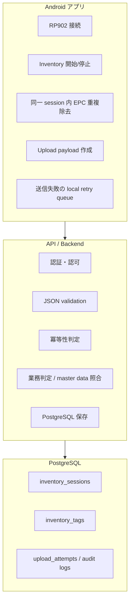

# 01 責務分担

この資料では、アプリ、API/backend、PostgreSQL の責務を分けます。責務を混ぜると、後から修正するときに「どちらを直せばよいか」が分かりにくくなります。

## 状態責務分担図

## アプリ側の責務

| 区分 | 内容 |
| --- | --- |
| 確定 | RP902 または fake reader から EPC を受け取る |
| 確定 | 同一 inventory session 内で同じ EPC を 1 行にまとめる |
| 確定 | `firstSeenAtEpochMillis`, `lastSeenAtEpochMillis`, `readCount` を作る |
| 確定 | session payload を作る |
| 確定 | upload 失敗時に local retry queue へ入れる土台がある |
| 未定 | 本番 API URL、認証情報、端末 ID の決め方 |

## サーバー側の責務

| 区分 | 内容 |
| --- | --- |
| 提案 | HTTP API を提供し、JSON payload を受け取る |
| 提案 | `sessionId` または別途 idempotency key で二重登録を防ぐ |
| 提案 | PostgreSQL へ session と tag を保存する |
| 提案 | 必要なら master data と照合し、結果 status を返す |
| サーバー側裁量 | 内部 service 分割、ORM、migration tool、job queue の選定 |
| 要合意 | レスポンス JSON の形式、エラー code、再送時の扱い |

## DB 側の責務

| 区分 | 内容 |
| --- | --- |
| 提案 | session 単位の親テーブルを持つ |
| 提案 | tag 単位の子テーブルを持つ |
| 提案 | 同一 session 内 EPC の unique 制約を持つ |
| サーバー側裁量 | surrogate key の種類、partition、index 詳細、監査ログの保持期間 |
| 要合意 | アプリから送られる ID を DB 上でどう扱うか |

## どこまでがアプリ確定事項か

現時点でアプリコードから確定的に言える payload 候補は次の通りです。

- `sessionId`: upload 実行時に UUID 文字列を生成
- `sentAtEpochMillis`: upload 実行時刻
- `deviceId`: 現在は `"android-local-device"` 固定値
- `readerType`: 現在は `"RP902"` 固定値
- `tags[].epc`
- `tags[].firstSeenAtEpochMillis`
- `tags[].lastSeenAtEpochMillis`
- `tags[].readCount`

## どこからがサーバー側裁量か

アプリと API 契約で直接やり取りしない内部実装は、基本的にサーバー側裁量です。

- PostgreSQL の物理設計
- 内部 primary key
- migration tool
- backend framework
- batch / job queue の有無
- audit log の詳細保持方式
- master data table の設計

## 要合意事項一覧

| 優先度 | 要合意事項 | 合意しないと危険な理由 |
| --- | --- | --- |
| 高 | API endpoint と HTTP method | アプリ実装の接続先が決まらない |
| 高 | request JSON の field 名と必須/任意 | payload validation で失敗する |
| 高 | 成功レスポンスの意味 | アプリが Completed と表示してよい条件が曖昧になる |
| 高 | 冪等性キー | retry で二重保存される危険がある |
| 高 | 認証方式 | 本番接続の安全性に関わる |
| 中 | `deviceId` の採番方法 | 端末別集計や監査が難しくなる |
| 中 | server received time と app sent time の扱い | 時刻ずれの解釈が曖昧になる |
| 中 | error code と retry 可否 | アプリが再送すべきか判断できない |
| 低 | 表示用メッセージ文言 | UX 調整で後から変更可能 |

