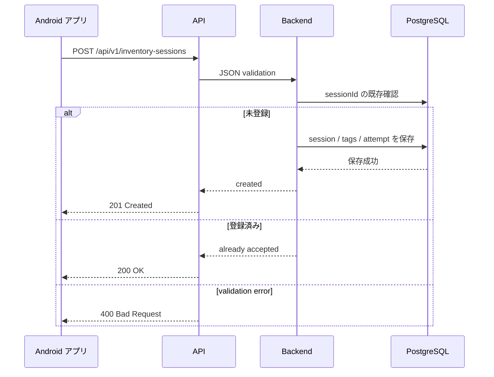

# 03 API契約案

この資料は、現行アプリの payload モデルを前提にした最小 API 契約案です。ここに書く endpoint や response は「提案」であり、まだ確定ではありません。

## 最小 API 方針

| 項目 | 区分 | 内容 |
| --- | --- | --- |
| 通信方式 | 提案 | HTTPS + JSON |
| endpoint | 提案 | `POST /api/v1/inventory-sessions` |
| upload 単位 | 確定 | inventory session 単位 |
| request body | 提案 | `InventoryUploadPayload` に近い JSON |
| idempotency key | 要合意 | 初期案は `sessionId` を使用 |
| 成功条件 | 要合意 | DB に保存できた、または同じ session が保存済みであること |
| 認証 | 未定 | API key、OAuth2、端末証明書などから選定 |

## Upload シーケンス図



## 推奨 request JSON

```json
{
  "sessionId": "4b89806b-1cde-4c8a-b96f-8f7d72fd2016",
  "sentAtEpochMillis": 1712345678901,
  "deviceId": "android-local-device",
  "readerType": "RP902",
  "tags": [
    {
      "epc": "E2806894000040035A1F90A1",
      "firstSeenAtEpochMillis": 1712345600000,
      "lastSeenAtEpochMillis": 1712345660000,
      "readCount": 3
    }
  ]
}
```

## 推奨成功レスポンス

新規保存の場合:

```json
{
  "status": "accepted",
  "sessionId": "4b89806b-1cde-4c8a-b96f-8f7d72fd2016",
  "serverReceivedAtEpochMillis": 1712345680123,
  "duplicate": false,
  "message": "Inventory session accepted."
}
```

同じ `sessionId` の retry を受けた場合:

```json
{
  "status": "accepted",
  "sessionId": "4b89806b-1cde-4c8a-b96f-8f7d72fd2016",
  "serverReceivedAtEpochMillis": 1712345680999,
  "duplicate": true,
  "message": "Inventory session was already accepted."
}
```

アプリ側は `status == "accepted"` を `UploadResult.Success` に変換する提案です。`duplicate: true` でも、サーバーが「すでに受領済み」と判断できるなら success 扱いがよいです。

## 推奨エラーレスポンス

validation error:

```json
{
  "status": "rejected",
  "errorCode": "VALIDATION_ERROR",
  "message": "tags must not be empty.",
  "retryable": false
}
```

一時障害:

```json
{
  "status": "failed",
  "errorCode": "TEMPORARY_UNAVAILABLE",
  "message": "Please retry later.",
  "retryable": true
}
```

認証失敗:

```json
{
  "status": "rejected",
  "errorCode": "UNAUTHORIZED",
  "message": "Authentication failed.",
  "retryable": false
}
```

## HTTP status の提案

| HTTP status | 意味 | アプリ側 retry |
| --- | --- | --- |
| `201 Created` | 新規 session を保存 | 不要 |
| `200 OK` | 同じ session を受領済み | 不要 |
| `400 Bad Request` | payload 不正 | 原則不要。アプリ修正対象 |
| `401 Unauthorized` | 認証失敗 | 原則不要。設定/認証修正対象 |
| `409 Conflict` | 同じ sessionId だが内容が異なる | 要調査。自動 retry は危険 |
| `429 Too Many Requests` | rate limit | retry 可 |
| `500/503` | サーバー一時障害 | retry 可 |

## リトライの考え方

| 観点 | 推奨 |
| --- | --- |
| アプリ側 | 送信失敗した payload を retry queue に残す |
| サーバー側 | 同じ payload が複数回来ても二重保存しない |
| 判定キー | 初期案は `sessionId` |
| 409 の扱い | 同じ `sessionId` で中身が違う場合は危険なので保存せず調査対象 |
| retryable flag | サーバーが返すとアプリが判断しやすい |

## 冪等性の考え方

冪等性とは、同じ request が 1 回来ても 2 回来ても、結果が壊れない性質です。モバイルアプリでは通信失敗や再送が起きるため重要です。

推奨:

- `sessionId` に unique 制約を置く。
- 同じ `sessionId` で同じ payload が再送されたら success として返す。
- 同じ `sessionId` で tags が異なる場合は `409 Conflict` にする。
- 将来必要なら HTTP header `Idempotency-Key` を追加する。

## 確定 / 提案 / 未定

| 項目 | 区分 |
| --- | --- |
| session 単位 upload | 確定 |
| `sessionId`, `sentAtEpochMillis`, `deviceId`, `readerType`, `tags` | 現行コード上の確定 |
| `POST /api/v1/inventory-sessions` | 提案 |
| response JSON | 提案 |
| `sessionId` を冪等性キーにする | 提案、要合意 |
| 認証方式 | 未定、要合意 |
| server-side business result の詳細 | 未定 |

