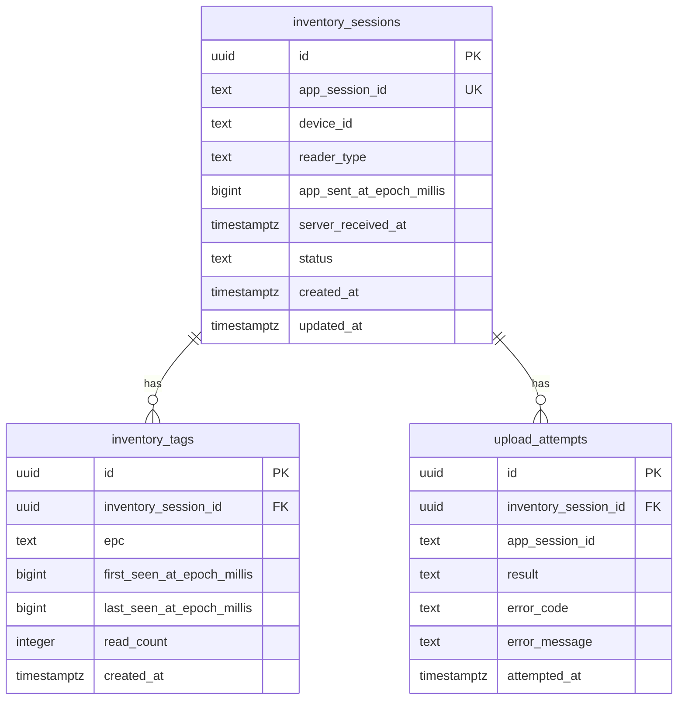

# 04 PostgreSQLデータモデル案

この資料は、PostgreSQL 前提での最小データモデル案です。DB の内部設計はサーバー側裁量ですが、アプリから送る値の意味と冪等性はアプリ側と合意が必要です。

## 最小テーブル構成



## `inventory_sessions` 案

```sql
CREATE TABLE inventory_sessions (
    id uuid PRIMARY KEY DEFAULT gen_random_uuid(),
    app_session_id text NOT NULL UNIQUE,
    device_id text NOT NULL,
    reader_type text NOT NULL,
    app_sent_at_epoch_millis bigint NOT NULL,
    server_received_at timestamptz NOT NULL DEFAULT now(),
    status text NOT NULL DEFAULT 'accepted',
    created_at timestamptz NOT NULL DEFAULT now(),
    updated_at timestamptz NOT NULL DEFAULT now()
);
```

| column | 区分 | 説明 |
| --- | --- | --- |
| `id` | サーバー側裁量 | DB 内部 primary key。UUID 以外でも可。 |
| `app_session_id` | 要合意 | アプリの `sessionId`。冪等性キー候補。 |
| `device_id` | 要合意 | 現在は仮固定値。本番では採番方式が必要。 |
| `reader_type` | 現行コード上の確定 | 現在は `"RP902"`。将来 reader 種別が増えるなら要合意。 |
| `app_sent_at_epoch_millis` | 現行コード上の確定 | アプリ端末時刻。正確性は端末時計に依存。 |
| `server_received_at` | サーバー側裁量 | サーバー受信時刻。DB で付与推奨。 |
| `status` | サーバー側裁量、要合意あり | API response と連動するなら値の合意が必要。 |

## `inventory_tags` 案

```sql
CREATE TABLE inventory_tags (
    id uuid PRIMARY KEY DEFAULT gen_random_uuid(),
    inventory_session_id uuid NOT NULL REFERENCES inventory_sessions(id) ON DELETE CASCADE,
    epc text NOT NULL,
    first_seen_at_epoch_millis bigint NOT NULL,
    last_seen_at_epoch_millis bigint NOT NULL,
    read_count integer NOT NULL CHECK (read_count > 0),
    created_at timestamptz NOT NULL DEFAULT now(),
    UNIQUE (inventory_session_id, epc)
);
```

| column | 区分 | 説明 |
| --- | --- | --- |
| `inventory_session_id` | サーバー側裁量 | 親 session への FK。 |
| `epc` | 要合意 | アプリが正規化済み EPC を送る。DB でも同一 session 内 unique 推奨。 |
| `first_seen_at_epoch_millis` | 現行コード上の確定 | アプリで最初に読んだ時刻。 |
| `last_seen_at_epoch_millis` | 現行コード上の確定 | アプリで最後に読んだ時刻。 |
| `read_count` | 現行コード上の確定 | 同一 session 内の読取回数。 |

## `upload_attempts` 案

```sql
CREATE TABLE upload_attempts (
    id uuid PRIMARY KEY DEFAULT gen_random_uuid(),
    inventory_session_id uuid REFERENCES inventory_sessions(id),
    app_session_id text NOT NULL,
    result text NOT NULL,
    error_code text,
    error_message text,
    attempted_at timestamptz NOT NULL DEFAULT now()
);
```

これは必須ではありませんが、retry や障害解析には有効です。

| 区分 | 判断 |
| --- | --- |
| 最小実装 | なくても開始可能 |
| 運用向け | あると問い合わせ対応が楽 |
| サーバー側裁量 | table 名、保持期間、詳細 column は自由 |

## インデックス案

```sql
CREATE INDEX idx_inventory_sessions_device_received
    ON inventory_sessions (device_id, server_received_at DESC);

CREATE INDEX idx_inventory_tags_epc
    ON inventory_tags (epc);

CREATE INDEX idx_upload_attempts_app_session
    ON upload_attempts (app_session_id, attempted_at DESC);
```

## サーバー側が自由に変えてよい範囲

- DB 内部 primary key の型
- table 名や schema 名
- ORM / migration tool
- index の追加
- partition / archive 方針
- audit log の詳細
- `server_received_at` や `created_at` の形式

## アプリ側と契約上合わせるべき範囲

| 項目 | 理由 |
| --- | --- |
| `sessionId` の意味 | retry と冪等性に関わる |
| 同じ `sessionId` 再送時の扱い | 二重保存防止に関わる |
| `epc` の正規化ルール | DB unique 判定に関わる |
| `readCount` の意味 | 読取回数の集計に関わる |
| response status | アプリの Completed / Failed 表示に関わる |
| error code / retryable | アプリが再送するかどうかに関わる |

