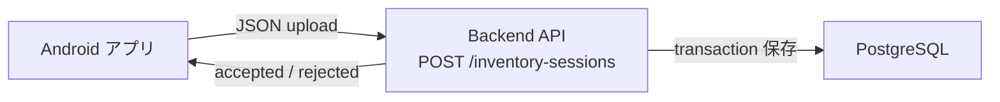
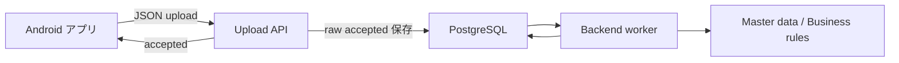
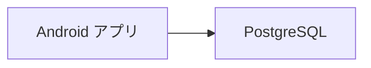

# 06 理想構成提案

この資料では、アプリ側とサーバー側のどちらもシンプルに開発しやすい構成を提案します。結論として、初期実装は「同期 API + PostgreSQL 保存 + sessionId 冪等性」を推奨します。

## 案A: 最小で実装しやすい案

### 内容

- アプリは session payload を HTTP POST する。
- backend は request を validation する。
- `sessionId` で既存 session を確認する。
- 未登録なら `inventory_sessions` と `inventory_tags` を 1 transaction で保存する。
- 登録済みなら success として返す。

### メリット

- 初期実装が一番簡単。
- アプリ側の `UploadRepository` 差し替えが小さい。
- retry と二重保存対策を実装しやすい。
- 障害時の切り分けが簡単。

### デメリット

- heavy な業務判定を同時に行うと API response が遅くなる。
- 大量 upload になった場合は非同期化を検討する必要がある。

### 評価

| 観点 | 評価 |
| --- | --- |
| 初期実装のしやすさ | 高 |
| 将来変更のしやすさ | 中 |
| アプリ修正の少なさ | 高 |
| 運用の単純さ | 高 |

## 案B: 将来拡張しやすい案

### 内容

- API はまず payload を受領・保存し、すぐ `accepted` を返す。
- 業務判定や master data 照合は worker が後続処理で行う。
- 結果確認 API や管理画面を後で追加する。

### メリット

- 業務判定が重くなっても upload API が遅くなりにくい。
- master data や判定ロジックの変更に強い。
- 監査ログを残しやすい。

### デメリット

- 初期構成が案Aより複雑。
- worker、job queue、処理状態管理が必要になる。
- アプリが即時判定結果を必要とする場合は別 API が必要。

### 評価

| 観点 | 評価 |
| --- | --- |
| 初期実装のしやすさ | 中 |
| 将来変更のしやすさ | 高 |
| アプリ修正の少なさ | 中 |
| 運用の単純さ | 中 |

## 案C: アプリが PostgreSQL へ直接接続する案

### 評価

この案は既定案にしません。

理由:

- DB 接続情報を Android アプリに持たせる必要があり危険。
- DB schema 変更がアプリ更新に直結する。
- 認証・認可・監査・retry 制御が難しい。
- モバイルネットワークから DB へ直接接続する運用は壊れやすい。

## 推奨案

初期実装は案Aを推奨します。

理由:

1. 現在のアプリは session payload を 1 回送る形に既に整理されている。
2. `UploadRepository` の HTTP 実装を追加すればアプリ側変更を小さくできる。
3. PostgreSQL 側は `inventory_sessions` と `inventory_tags` から始められる。
4. `sessionId` unique 制約で retry の二重保存を防ぎやすい。
5. 将来、業務判定が重くなったら案Bへ拡張できる。

## 案Aから案Bへ拡張する道筋

1. まず案Aで session と tags を保存する。
2. 保存済み session に `processing_status` を追加する。
3. worker を追加して未処理 session を処理する。
4. 必要なら結果取得 API を追加する。
5. アプリは upload API を変えず、必要になった時点で結果確認機能を追加する。

