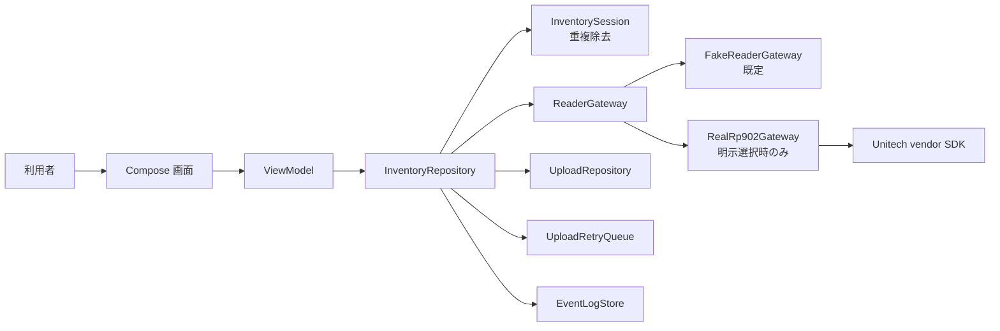

# 00 はじめに

この資料は、TraceLink RP902 App を初めて読む人が「何をするアプリか」「どの画面が何につながるか」「どのファイルを読めばよいか」を短時間でつかむための入口です。

## このアプリがすること

このアプリは、Unitech RP902 という RFID リーダーで UHF RFID タグを読み取り、読み取った EPC を画面に表示し、読み取りセッション単位でアップロードできる形にまとめる Android アプリです。

現時点では、開発しやすさと安全性を優先して、起動直後は本物の RP902 ではなく fake reader を使います。fake reader は、実機がなくてもタグ読取のような動きを再現するテスト用のリーダーです。

## 想定している利用シーン

1. 作業者が Android 端末でアプリを開く。
2. RP902 リーダーに接続する。
3. Inventory を開始する。
4. RFID タグを近づける。
5. 画面に EPC が表示される。
6. 同じ EPC は同じセッション内で 1 件にまとめられ、読取回数だけ増える。
7. セッション結果を backend へ送信する。
8. 送信に失敗した場合は retry queue に残し、あとで再送する。

backend の本実装はまだ未確定です。現在の upload は、将来の本物サーバー接続に備えた土台です。

## 3 分で分かる全体像

図の読み方:

- 左から右へ、ユーザー操作が内部処理へ進みます。
- UI は画面表示とクリック通知だけを担当します。
- ViewModel は画面向けの状態を作ります。
- Repository は読取、重複除去、upload、ログをまとめて進行します。
- ReaderGateway は fake reader と real RP902 を差し替える境界です。
- vendor SDK は `RealRp902Gateway` の内側に閉じ込めます。

## まず覚える 5 つの考え方

| 用語 | やさしい説明 |
| --- | --- |
| UI | 画面です。ボタンやリストを表示します。 |
| ViewModel | 画面に出す状態を作る係です。 |
| Repository | アプリの処理をまとめて進める係です。 |
| Gateway | 外部機器や外部処理とつなぐ窓口です。RP902 もここに隠します。 |
| UDF | データが一方向に流れる設計です。画面が勝手に内部状態を書き換えないようにします。 |

## この資料群の読み方

初めて読む場合は、この順番がおすすめです。

1. `00_はじめに.md`: アプリの目的をつかむ。
2. `01_全体構成.md`: フォルダとレイヤーを知る。
3. `02_画面と機能の説明.md`: 画面操作とコードのつながりを見る。
4. `03_処理フロー.md`: Connect / Start / Tag read / Upload の流れを見る。
5. `04_クラス責務一覧.md`: 主要クラスの役割を確認する。

そのあと、データの流れ、状態遷移、デバッグ、変更ガイド、FAQ を必要に応じて読んでください。
