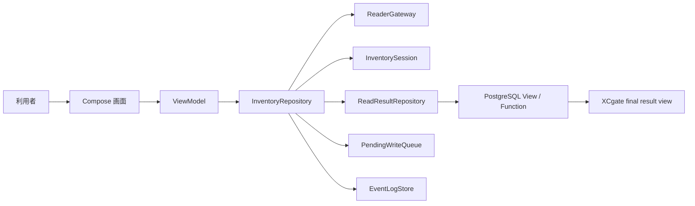

# 00 はじめに

この資料は、TraceLink RP902 App を初めて読む人が、アプリの目的と読む順番をつかむための入口です。

## このアプリがすること

このアプリは、Unitech RP902 で UHF RFID タグを読み取り、同一 session 内の EPC を重複除去し、Android 端末内で判定して、PostgreSQL に読取結果を登録する Android アプリです。

専用中間アプリケーションは置きません。主要要素は Android アプリ、PostgreSQL、XCgate です。

## 想定している利用シーン

1. 作業者が Android 端末でアプリを開く。
2. RP902 リーダーに接続する。
3. 作業対象を確定する。
4. PostgreSQL から帳票ルールと設備マスタを取得する。
5. Inventory を開始する。
6. RFID タグを読み取る。
7. 同じ EPC は同じ session 内で 1 件にまとめる。
8. Android 端末内で判定する。
9. 判定済み読取結果を PostgreSQL function 経由で登録する。
10. 登録失敗時は pending write に残し、後で再実行する。
11. XCgate は PostgreSQL の final result view を参照する。

## 3 分で分かる全体像

図の読み方:

- UI は画面表示とクリック通知だけを担当します。
- ViewModel は画面向けの状態を作ります。
- Repository は読取、重複除去、結果登録、ログをまとめて進行します。
- ReaderGateway は fake reader と real RP902 を差し替える境界です。
- PostgreSQL 実装は View / Function の境界に閉じ込めます。

## まず覚える考え方

| 用語 | 説明 |
| --- | --- |
| UDF | データが一方向に流れる設計です。画面が内部状態を直接書き換えません。 |
| Repository | 画面操作を lower layer の処理へつなぐ係です。 |
| Gateway | 外部機器や PostgreSQL など、外側との境界です。 |
| Local judgement | Android 端末内で rule/master と読取結果を照合して判定する処理です。 |
| Pending write | PostgreSQL 登録に失敗した bundle を後で再実行するための保留です。 |

## この資料群の読み方

1. `00_はじめに.md`: アプリの目的をつかむ。
2. `01_全体構成.md`: フォルダとレイヤーを知る。
3. `02_画面と機能の説明.md`: 画面操作とコードのつながりを見る。
4. `03_処理フロー.md`: 読取から PostgreSQL 登録までの流れを見る。
5. `04_クラス責務一覧.md`: 主要クラスの役割を確認する。
