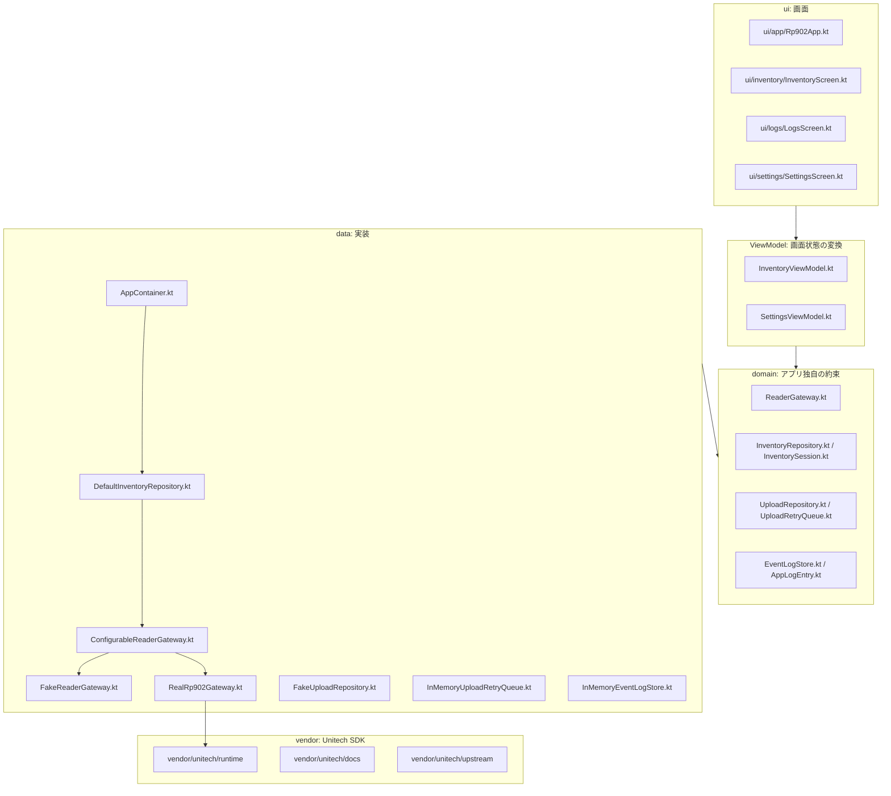

# 01 全体構成

この資料では、アプリ全体を大きな部品に分けて説明します。細かいコードに入る前に、「どの種類の処理をどこに書くのか」を理解することが目的です。

## 全体概要図

図の読み方:

- `ui` は画面です。vendor SDK を直接呼んではいけません。
- `ViewModel` は repository の状態を画面用に変換します。
- `domain` は「アプリ内の約束」を置く場所です。できるだけ Android や vendor に依存しない形にします。
- `data` は domain の約束を実際に動かす実装です。
- `vendor` は Unitech SDK の保管場所です。アプリが参照するのは `runtime` の安定パスだけです。

## 主要レイヤーの役割

| レイヤー | 置き場所 | 担当すること | 担当しないこと |
| --- | --- | --- | --- |
| UI | `app/src/main/java/.../ui` | 画面表示、ボタン押下の通知 | RP902 SDK 呼び出し、upload 実行判断 |
| ViewModel | `ui/*/*ViewModel.kt` | repository state を UI state に変換、ユーザー操作を repository に渡す | vendor SDK の扱い、重複除去ロジック |
| Domain | `domain` | 契約、状態モデル、純粋ロジック | Android 権限 API、Unitech API |
| Data | `data` | reader / upload / log / retry queue の具体実装 | Compose 表示 |
| Vendor | `vendor/unitech` | Unitech 配布物の保管 | アプリ独自ロジック |
| Docs | `docs` | 仕様、設計、引き継ぎ説明 | 実行コード |

## フォルダごとの読み方

| フォルダ | 何が入っているか | 変更するときの注意 |
| --- | --- | --- |
| `domain/reader` | reader 接続状態、設定、Gateway 契約 | vendor 固有型を入れない |
| `domain/inventory` | inventory repository 契約、重複除去、タグモデル | UI や Android API に依存させない |
| `domain/upload` | upload payload、upload 契約、retry queue 契約 | backend 未確定なので柔軟に保つ |
| `domain/log` | 構造化ログモデル | 表示形式は UI 側で決める |
| `data/reader` | fake / real reader 実装と切替 | UI へ vendor 型を漏らさない |
| `data/inventory` | 読取、重複除去、upload、ログの orchestration | 責務が広がりすぎたら契約を分ける |
| `data/upload` | fake upload、in-memory retry queue | 永続化導入時は契約を保つ |
| `data/log` | in-memory log store | ログ保存先を変えても UI 契約を保つ |
| `ui/inventory` | Inventory 画面と UI state | ボタンで直接 upload/gateway を触らない |
| `ui/settings` | reader mode、MAC、権限 preflight | 設定保存の永続化は repository 側へ寄せる |
| `ui/logs` | ログ表示 | ログ生成はしない |

## どこに何を書くべきか

| やりたい変更 | 書く場所 |
| --- | --- |
| 画面に表示項目を増やす | `ui/*Screen.kt` と `*UiState.kt` |
| ボタンの押下先を増やす | `ViewModel` に関数を追加し、repository に渡す |
| 読取ロジックを変える | `data/reader` または `domain/inventory` |
| 同一 EPC の扱いを変える | `InventorySession.kt` |
| 本物サーバーへ送信する | `UploadRepository` の新しい実装 |
| 送信失敗の保存方法を変える | `UploadRetryQueue` の新しい実装 |
| RP902 SDK 呼び出しを増やす | `RealRp902Gateway.kt` の adapter boundary 内 |
| Bluetooth 権限判定を変える | `ReaderConnectionPreflight.kt` と Android mapper |

## 壊しやすい境界

1. UI から vendor SDK を直接呼ぶ変更  
   画面が SDK に依存すると、fake reader と real RP902 の差し替えが難しくなります。

2. `InventorySession` に Android 依存を入れる変更  
   重複除去の単体テストが難しくなります。

3. `DefaultInventoryRepository` に backend 通信詳細を埋め込む変更  
   retry queue や upload transport の差し替えが難しくなります。

4. `RealRp902Gateway` から vendor 型を domain/ui へ返す変更  
   vendor SDK がアプリ全体へ広がり、今後の SDK 差し替えが重くなります。

5. fake default を変える変更  
   実機がない環境で開発やテストがしにくくなります。
