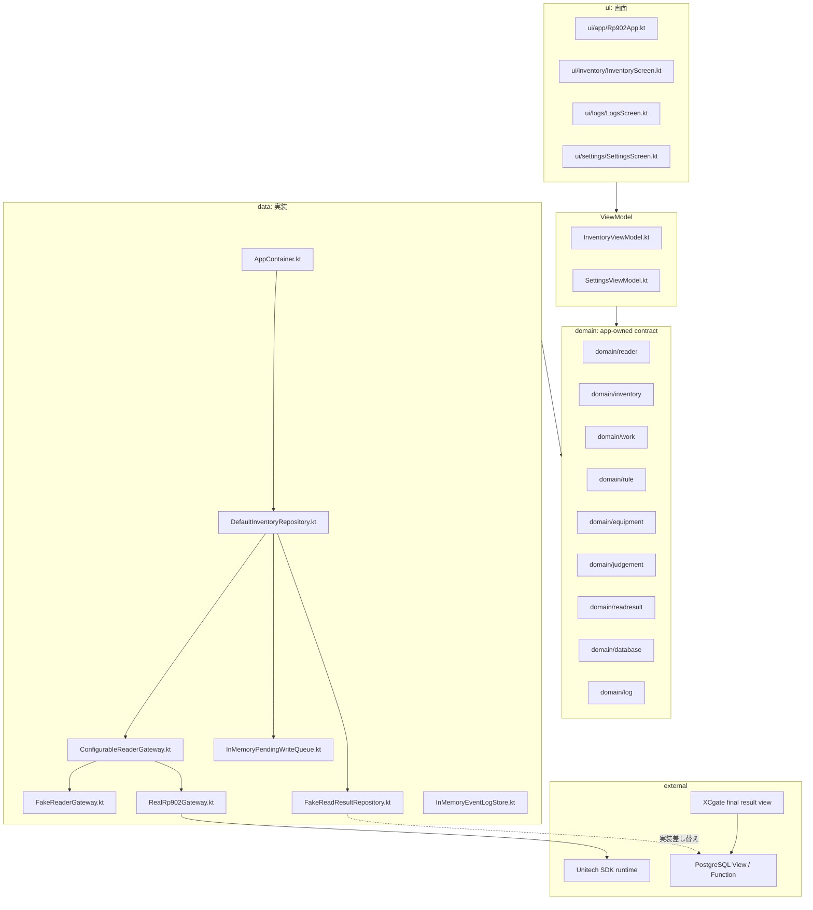

# 01 全体構成

この資料では、アプリ全体を大きな部品に分けて説明します。

## 全体概要図

## 主要レイヤーの役割

| レイヤー | 置き場所 | 担当すること | 担当しないこと |
| --- | --- | --- | --- |
| UI | `ui` | 画面表示、ボタン押下の通知 | RP902 SDK 呼び出し、PostgreSQL 接続 |
| ViewModel | `ui/*/*ViewModel.kt` | repository state を UI state に変換 | vendor SDK、SQL、判定ロジック |
| Domain | `domain` | 契約、状態モデル、純粋ロジック | Android 権限 API、Unitech API、DB driver |
| Data | `data` | reader / result / log / pending write の具体実装 | Compose 表示 |
| Vendor | `vendor/unitech` | Unitech 配布物の保管 | アプリ独自ロジック |
| Docs | `docs` | 仕様、設計、引き継ぎ説明 | 実行コード |

## フォルダごとの読み方

| フォルダ | 何が入っているか | 変更するときの注意 |
| --- | --- | --- |
| `domain/reader` | reader 接続状態、設定、Gateway 契約 | vendor 固有型を入れない |
| `domain/inventory` | inventory repository 契約、重複除去、タグモデル | UI や Android API に依存させない |
| `domain/work` | 作業対象 context | UI 固有の入力 state を入れない |
| `domain/rule` | 帳票ルール bundle | DB table 形状を直接持ち込まない |
| `domain/equipment` | 設備マスタ snapshot | PostgreSQL の内部構造を出さない |
| `domain/judgement` | 端末内判定サービス | DB 接続や UI 表示を入れない |
| `domain/readresult` | 読取結果登録、pending write、登録状態 | 通信方式ではなく結果登録の責務で命名する |
| `domain/database` | PostgreSQL gateway 境界 | UI/ViewModel から直接使わせない |
| `data/reader` | fake / real reader 実装と切替 | UI へ vendor 型を漏らさない |
| `data/inventory` | 読取 workflow orchestration | rule/master/judgement を増やす場合は契約を分ける |
| `data/readresult` | fake 結果登録、in-memory pending write | 実 DB 接続時も契約を保つ |
| `ui/inventory` | Inventory 画面と UI state | ボタンで直接 gateway/repository を作らない |

## 壊しやすい境界

1. UI から vendor SDK や PostgreSQL 実装を直接呼ぶ変更。
2. `InventorySession` に Android 依存や DB 依存を入れる変更。
3. `DefaultInventoryRepository` に SQL や table 名を埋め込む変更。
4. `RealRp902Gateway` から vendor 型を domain/ui へ返す変更。
5. fake default を理由なく real に変える変更。
