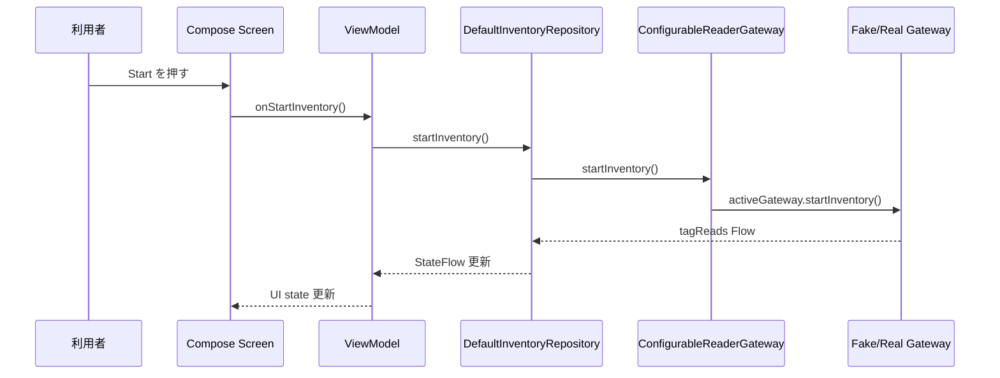

# 02 画面と機能の説明

この資料では、画面で押すボタンが内部のどのコードにつながるかを説明します。コードを読むときは、まずこの対応表を見ると迷いにくくなります。

## 画面構成

アプリには下部ナビゲーションで切り替える 3 画面があります。

| 画面 | ファイル | 目的 |
| --- | --- | --- |
| Inventory | `ui/inventory/InventoryScreen.kt` | reader 接続、inventory 開始/停止、タグ一覧、upload 操作 |
| Logs | `ui/logs/LogsScreen.kt` | app 内で発生した構造化ログを見る |
| Settings | `ui/settings/SettingsScreen.kt` | fake/real 切替、RP902 MAC、Bluetooth 権限と preflight 確認 |

画面切替は `ui/app/Rp902App.kt` の `AppRoute` で管理しています。

## Inventory 画面

Inventory 画面は、RFID 読取作業の中心です。

### 表示項目

| 表示 | 意味 | 主な元データ |
| --- | --- | --- |
| Reader | reader の接続状態 | `ReaderConnectionState` |
| Inventory | 読取中かどうか | `InventoryRepositoryState.isInventoryRunning` |
| Unique tags | セッション内の重複除去後 EPC 件数 | `InventorySession.snapshot()` |
| Upload | upload の状態 | `UploadState` |
| Queued | 再送待ち件数 | `UploadRetryQueue.pendingUploads` |
| Tags | 読み取った EPC 一覧 | `InventoryTag` |
| Recent log | 直近ログ | `AppLogEntry` |

### ボタンと内部処理

| ボタン | 画面の callback | ViewModel | Repository | その先 |
| --- | --- | --- | --- | --- |
| Connect | `onConnect` | `InventoryViewModel.connect()` | `DefaultInventoryRepository.connect()` | `ConfigurableReaderGateway.connect()` |
| Disconnect | `onDisconnect` | `disconnect()` | `disconnect()` | active gateway の disconnect |
| Start | `onStartInventory` | `startInventory()` | `startInventory()` | active gateway の `startInventory()` |
| Stop | `onStopInventory` | `stopInventory()` | `stopInventory()` | active gateway の `stopInventory()` |
| Upload | `onUpload` | `uploadSession()` | `uploadSession()` | `UploadRepository.upload()` |
| Retry | `onRetryPendingUploads` | `retryPendingUploads()` | `retryPendingUploads()` | `UploadRetryQueue` の pending を再送 |
| Clear | `onClearSession` | `clearSession()` | `clearSession()` | `InventorySession.clear()` |

重要な点:

- Composable はボタンが押されたことを伝えるだけです。
- upload 実行や reader 操作の判断は Composable ではなく ViewModel / Repository が担当します。
- UI state は domain/data state の投影です。UI が独自に真の状態を持たないようにします。

## Logs 画面

Logs 画面は `ui/logs/LogsScreen.kt` です。

ここに出るログは、`DefaultInventoryRepository` が `EventLogStore` に保存した `AppLogEntry` です。real RP902 の接続失敗、preflight 失敗、vendor callback 到達有無などもここで確認できます。

Logs 画面はログを作りません。表示だけを担当します。

## Settings 画面

Settings 画面は reader の接続前準備を行います。

### 表示項目

| 表示 | 意味 |
| --- | --- |
| Fake reader | 実機なしの開発用 reader を使う |
| Real RP902 | 本物の RP902 SDK 経路を使う |
| RP902 Bluetooth MAC | 接続対象 RP902 の Bluetooth MAC address。今回運用では `DC:0D:30:DA:0F:3C` が初期値として入る |
| Real RP902 preflight | 実機接続前の準備状態 |
| Required permissions | この端末 OS で必要な権限 |
| Missing permissions | まだ許可されていない権限 |
| Blocking reasons | 接続を止めている理由 |

### 操作と内部処理

| 操作 | ViewModel | 主な処理 |
| --- | --- | --- |
| Fake reader を選ぶ | `updateGatewayMode(Fake)` | `ReaderSettingsRepository` を更新 |
| Real RP902 を選ぶ | `updateGatewayMode(RealRp902)` | gateway 切替条件を更新 |
| MAC を入力 | `updateReaderAddressInput()` | 初期値は `DC:0D:30:DA:0F:3C`。必要なら別 MAC に編集でき、`ReaderBluetoothAddress.parse()` で検証 |
| Request permissions | `updatePermissionSnapshot()` | Android 権限結果を app-owned state に変換 |
| Refresh | `updateBluetoothState()` | Bluetooth adapter 状態を読み直す |
| Open Bluetooth settings | Android 設定画面を開く | Bluetooth 有効化はユーザー操作で行う |

## 画面操作からコードへの最短ルート

この流れを覚えると、ほとんどの操作を追えるようになります。
