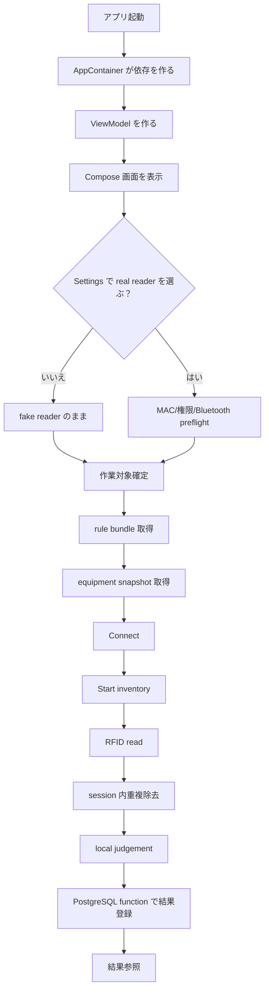
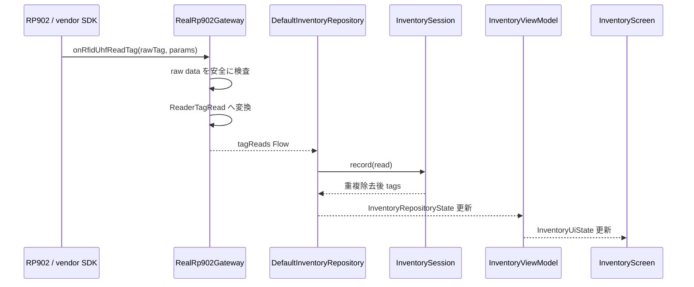
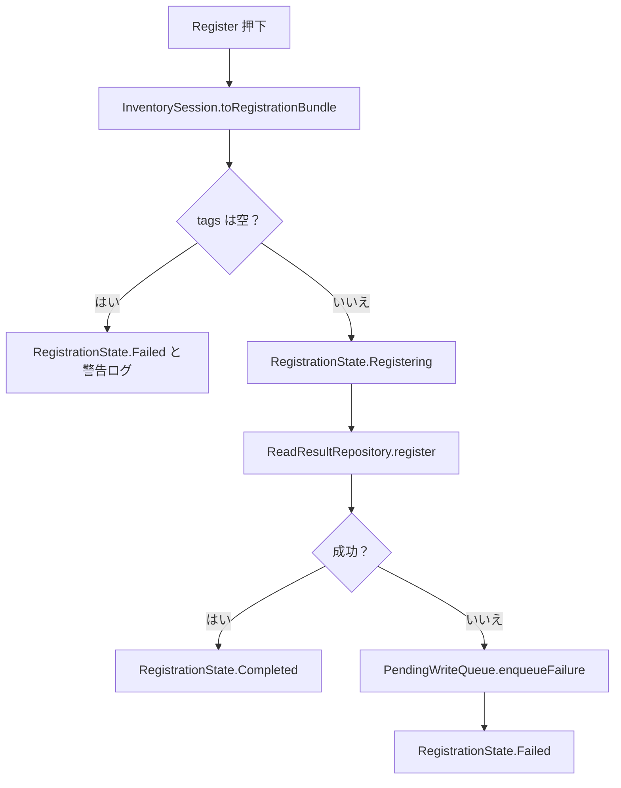

# 03 処理フロー

この資料では、ユーザー操作ごとに内部処理がどう進むかを説明します。

## 全体フローチャート

## Tag 読取の詳細フロー

## 結果登録の詳細フロー

現在の `FakeReadResultRepository` は fake 実装です。PostgreSQL 実接続時は `ReadResultRepository` の別実装を追加します。

## 異常時のフロー

| 異常 | 主な検出場所 | どう扱うか |
| --- | --- | --- |
| MAC 未設定 | `ReaderConnectionPreflight` | 接続前に止め、Settings/Logs に理由を出す |
| 権限不足 | `ReaderConnectionPreflight` | vendor SDK 呼び出し前に止める |
| Bluetooth 無効 | `ReaderConnectionPreflight` | Bluetooth settings へ誘導 |
| vendor connect 失敗 | `RealRp902Gateway.connect` | `ReaderConnectionState.Error` とログ |
| tag callback の raw EPC が空 | `Rp902TagEventMapper` | Warning log を出して無視 |
| 結果登録失敗 | `DefaultInventoryRepository` | pending write に保存 |
| repository command 例外 | `runReaderCommand` | Error log に残す |
