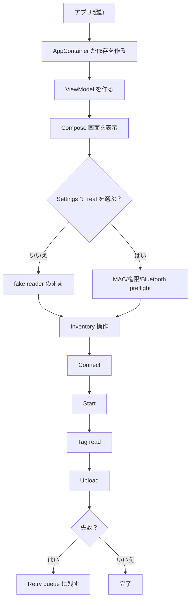
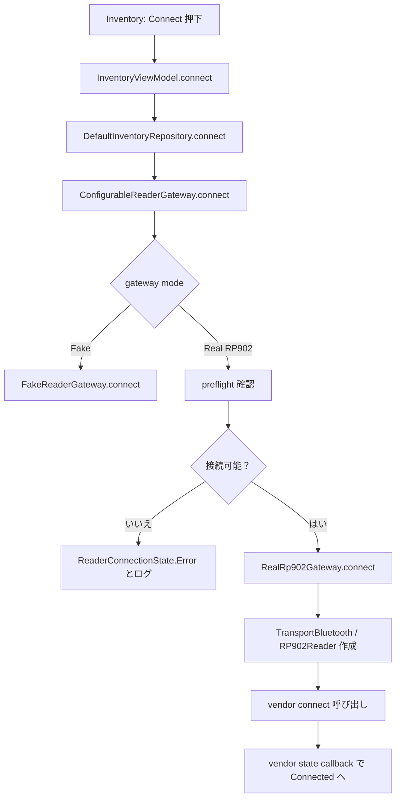
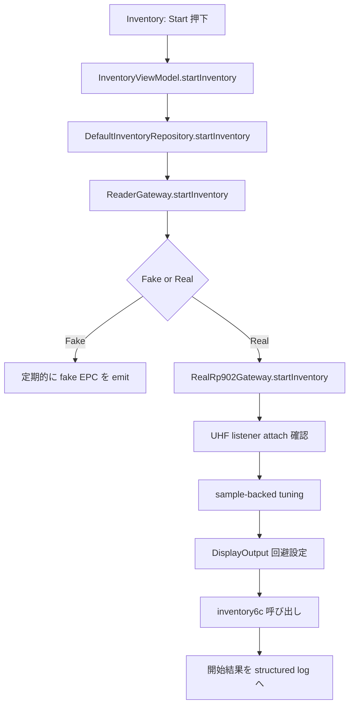
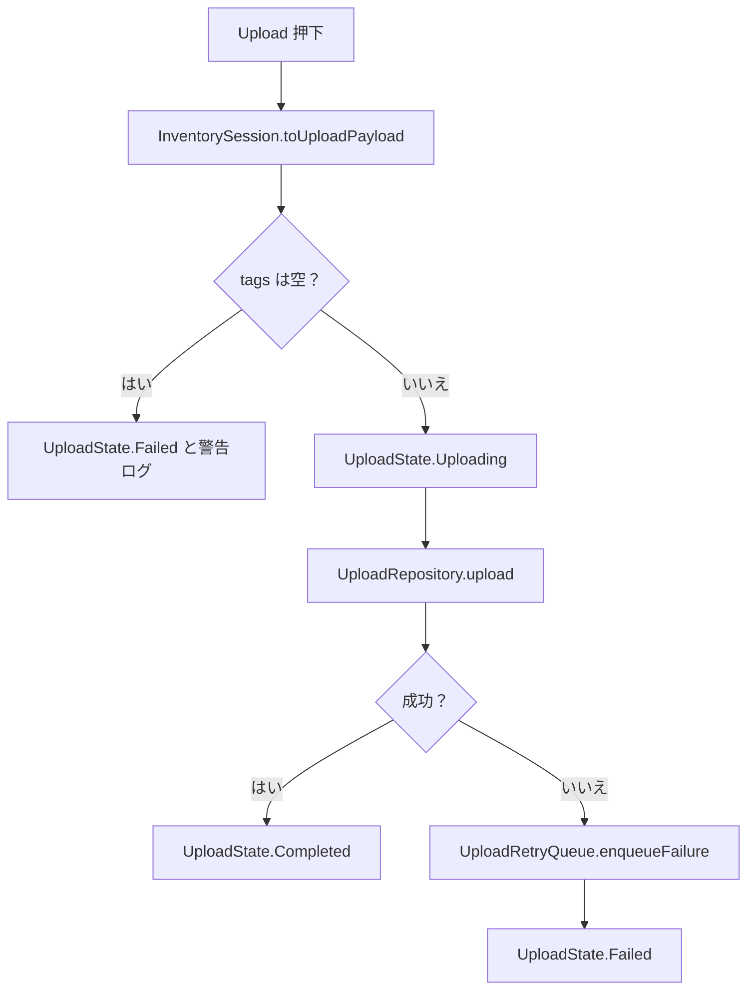
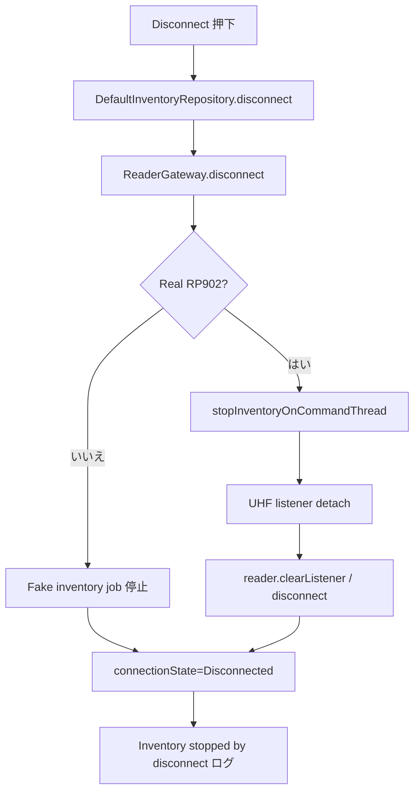

# 03 処理フロー

この資料では、ユーザー操作ごとに内部処理がどう進むかを説明します。

## 全体フローチャート

## Connect の詳細フロー

real mode でも、preflight が失敗したら vendor SDK に進みません。接続できない理由は Settings と Logs の両方で確認できます。

## Start の詳細フロー

real path は vendor command を worker 側 dispatcher で実行し、UI main thread を塞がないようにしています。

## Tag 読取の詳細フロー

重要:

- callback は vendor SDK 側から来る通知です。アプリ側から呼ぶものではありません。
- 空 EPC や大きすぎる EPC は、アプリ全体を落とさずログ付きで無視します。
- 同一 EPC は `InventorySession` で 1 件にまとめ、`readCount` を増やします。

## Upload の詳細フロー

現在の `FakeUploadRepository` は fake 実装です。本物サーバー接続時は `UploadRepository` の別実装を追加します。

## Disconnect の詳細フロー

## 異常時のフロー

| 異常 | 主な検出場所 | どう扱うか |
| --- | --- | --- |
| MAC 未設定 | `ReaderConnectionPreflight` | 接続前に止め、Settings/Logs に理由を出す |
| 権限不足 | `ReaderConnectionPreflight` | vendor SDK 呼び出し前に止める |
| Bluetooth 無効 | `ReaderConnectionPreflight` | Bluetooth settings へ誘導 |
| vendor connect 失敗 | `RealRp902Gateway.connect` | `ReaderConnectionState.Error` とログ |
| tag callback の raw EPC が空 | `Rp902TagEventMapper` | Warning log を出して無視 |
| upload 失敗 | `DefaultInventoryRepository` | retry queue に保存 |
| repository command 例外 | `runReaderCommand` | Error log に残す |
