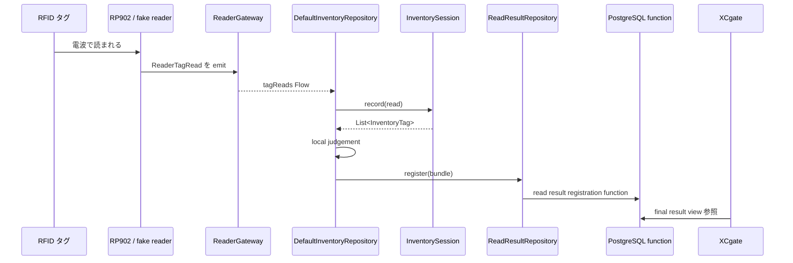
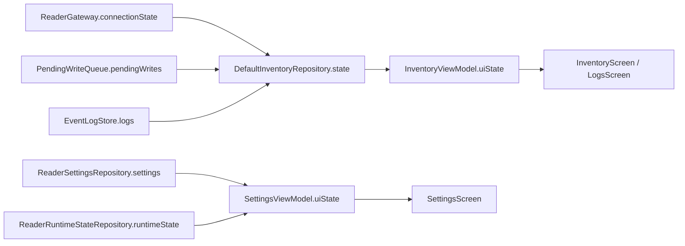
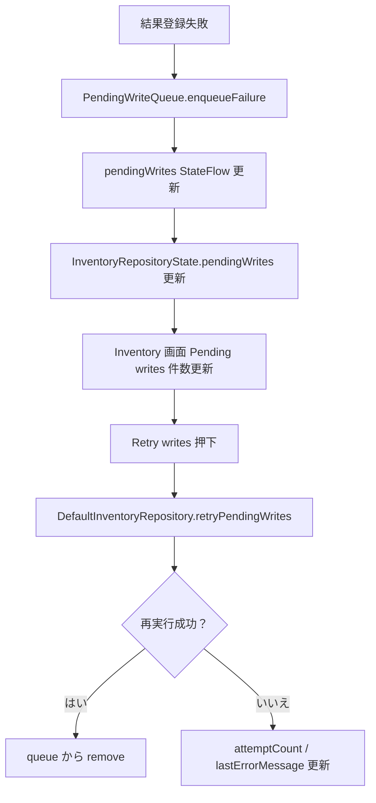

# 05 データの流れ

この資料では、タグデータ、状態データ、ログ、pending write がアプリ内をどう流れるかを説明します。

## タグデータから結果登録まで

## 主なデータ型

| データ | 役割 |
| --- | --- |
| `ReaderTagRead` | 1 回読めたという app-owned 読取データ |
| `InventoryTag` | 同じ EPC をまとめた後の session 内データ |
| `ReadResultRegistrationBundle` | PostgreSQL function へ渡す登録単位 |
| `RegistrationState` | 登録操作の状態 |
| `PendingWrite` | 登録失敗後に保留された bundle |

## 状態データの流れ

重要:

- Repository state が source of truth です。
- UI state は表示しやすく変換した projection です。
- 画面側で勝手に reader 接続状態や登録状態を作らないようにします。

## Pending write の流れ

現在の queue は in-memory です。将来は `PendingWriteQueue` の契約を保ったまま Room などへ差し替えます。
