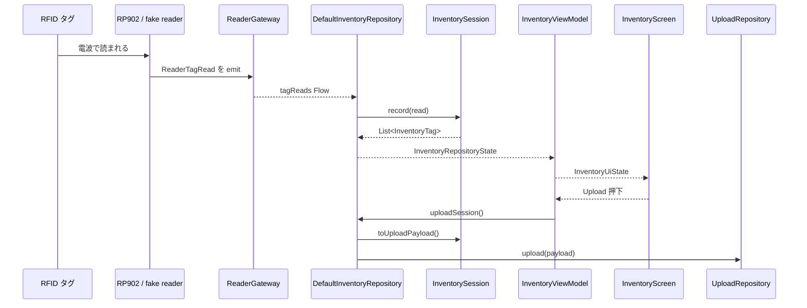
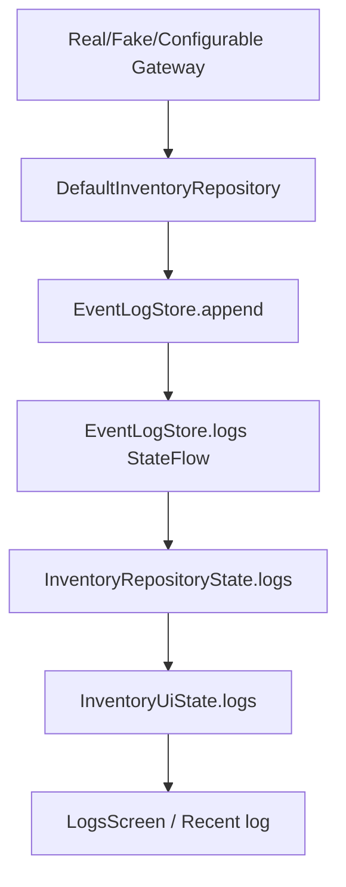
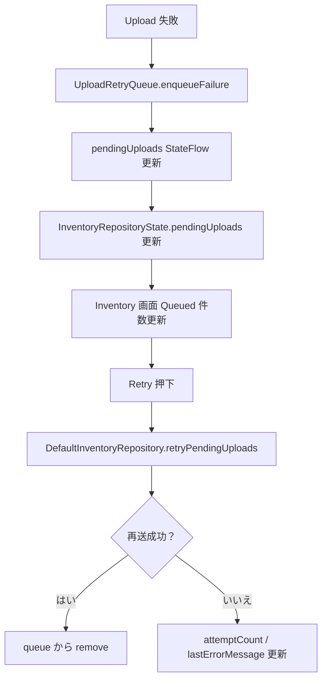

# 05 データの流れ

この資料では、タグデータ、状態データ、ログ、retry queue がアプリ内をどう流れるかを説明します。

## タグデータの流れ

読み方:

- `ReaderTagRead` は「1 回読めた」という生に近い app-owned データです。
- `InventoryTag` は「同じ EPC をまとめた後」の画面向けデータです。
- `InventoryUploadPayload` は backend へ送る単位です。

## RP902 から UI まで

| 段階 | データ | 役割 |
| --- | --- | --- |
| vendor callback | `String? tag`, `Any? params` | vendor SDK から届く raw data |
| adapter mapping | `ReaderTagRead` | vendor 型を隠した app-owned 読取データ |
| repository | `InventoryRepositoryState` | 画面、upload、retry、log をまとめた状態 |
| ViewModel | `InventoryUiState` | 画面がそのまま表示できる状態 |
| UI | `InventoryTag` list | EPC、read count、last seen を表示 |

## 状態データの流れ

重要:

- Repository state が source of truth です。
- UI state は表示しやすく変換した projection です。
- 画面側で勝手に reader 接続状態や upload 状態を作らないようにします。

## ログの流れ

ログは `AppLogEntry` という構造化モデルです。

| 項目 | 意味 |
| --- | --- |
| `id` | log store 内の連番 |
| `occurredAtEpochMillis` | 発生時刻 |
| `level` | Info / Warning / Error |
| `category` | System / Reader / Inventory / Upload |
| `message` | 人が読む説明 |

実機デバッグでは、`Reader` category のログが特に重要です。

## Retry queue の流れ

現在の queue は in-memory です。つまり、アプリを終了すると消えます。将来は `UploadRetryQueue` の契約を保ったまま DataStore や Room などへ差し替える想定です。

## fake reader と real reader の違い

| 観点 | fake reader | real RP902 |
| --- | --- | --- |
| 実機 | 不要 | 必要 |
| 既定動作 | はい | いいえ。Settings で明示選択 |
| タグ発生 | fake EPC を定期 emit | vendor callback から届く |
| Bluetooth 権限 | 不要 | 必要 |
| vendor SDK | 使わない | `RealRp902Gateway` 内だけで使う |
| テスト容易性 | 高い | 実機検証が必要 |

両方とも `ReaderGateway` として扱えるため、Repository から見ると同じ形です。
