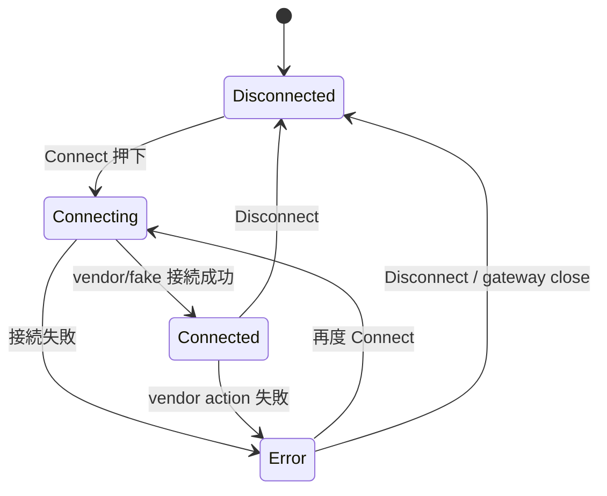
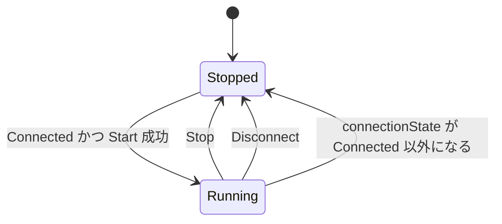
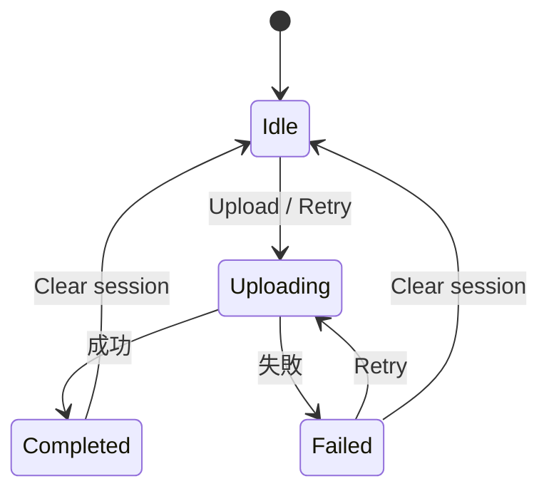

# 06 状態遷移

この資料では、アプリ内の主な状態がどの条件で変わるかを説明します。

## Reader 状態

Reader 接続状態は `ReaderConnectionState` です。

| 状態 | 意味 | 画面表示 |
| --- | --- | --- |
| `Disconnected` | 接続していない | Reader: Disconnected |
| `Connecting` | 接続処理中 | Reader: Connecting |
| `Connected` | 接続済み | Reader: Connected |
| `Error(message)` | 接続または reader 操作で失敗 | Reader: Error |

注意:

- real mode の preflight 失敗も `Error` になります。
- `Disconnected` でも logs に過去エラーは残ります。

## Inventory 状態

Inventory 実行状態は `InventoryRepositoryState.isInventoryRunning` です。

重要:

- Start ボタンは reader が `Connected` のときだけ有効です。
- Disconnect すると inventory は止まった扱いになります。
- vendor SDK の内部状態と app state がズレる可能性があるため、real path では stop summary log を見て確認します。

## Upload 状態

Upload 状態は `UploadState` です。

| 状態 | 意味 |
| --- | --- |
| `Idle` | upload 待機中 |
| `Uploading` | upload または retry 中 |
| `Completed(sessionId)` | 送信成功 |
| `Failed(message)` | 送信失敗 |

失敗した non-empty payload は retry queue に残ります。

## Settings / Preflight 状態

Settings では、real RP902 接続前に以下を確認します。

| 条件 | 対応する failure |
| --- | --- |
| MAC address がない | `BluetoothAddressMissing` |
| runtime permission が足りない | `RuntimePermissionsMissing` |
| Bluetooth 状態未確認 | `BluetoothStatusUnknown` |
| Bluetooth 無効 | `BluetoothDisabled` |
| Bluetooth adapter なし | `BluetoothUnavailable` |
| Bluetooth 状態確認に権限がない | `BluetoothStatusPermissionMissing` |

fake mode では Bluetooth preflight は不要です。

## よくある状態不整合ポイント

1. 画面の Start ボタンは押せるが実機が読まない  
   app state では `Connected` でも、vendor callback が来ていない可能性があります。Logs の `callbackTotal` と `First RP902 tag callback reached` を確認します。

2. Stop したつもりだが実機側で処理が残っている  
   real path では `RP902 stop() returned ...` ログを確認します。

3. Settings で real を選んだのに Connect が止まる  
   preflight failure が残っています。今回運用では MAC 初期値 `DC:0D:30:DA:0F:3C` が入っていますが、別リーダーの場合は MAC、権限、Bluetooth 状態を確認します。

4. Upload が失敗したが Tags は残っている  
   読取セッションと upload state は別です。失敗 payload は retry queue に残ります。

5. Clear したら upload 状態も Idle になる  
   現在の実装では、セッションの読み取り結果と upload state を一緒に初期化します。
