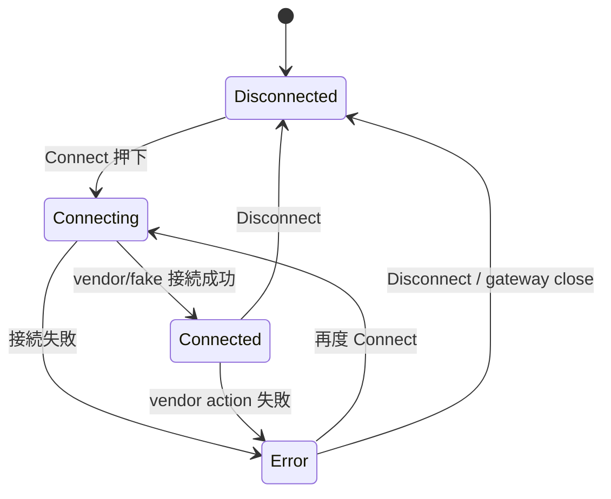
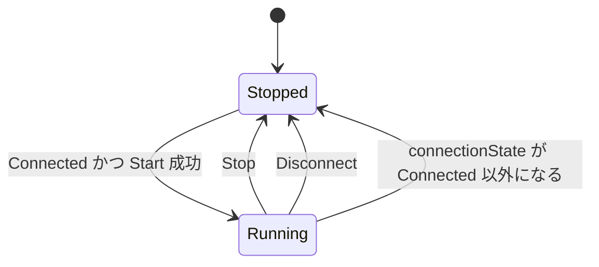
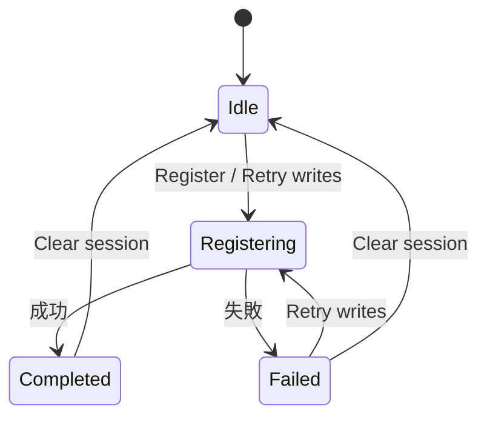

# 06 状態遷移

この資料では、アプリ内の主な状態がどの条件で変わるかを説明します。

## Reader 状態

Reader 接続状態は `ReaderConnectionState` です。

## Inventory 状態

Inventory 実行状態は `InventoryRepositoryState.isInventoryRunning` です。

## Registration 状態

結果登録状態は `RegistrationState` です。

| 状態 | 意味 |
| --- | --- |
| `Idle` | 結果登録待機中 |
| `Registering` | PostgreSQL function への登録または pending write 再実行中 |
| `Completed(sessionId)` | 登録成功 |
| `Failed(message)` | 登録失敗 |

失敗した non-empty bundle は pending write に残ります。

## Settings / Preflight 状態

fake mode では Bluetooth preflight は不要です。real RP902 接続前だけ、MAC、runtime permission、Bluetooth 状態を確認します。

## よくある状態不整合ポイント

1. 画面の Start ボタンは押せるが実機が読まない  
   Logs の callback count と tag callback 到達ログを確認します。

2. Stop したつもりだが実機側で処理が残っている  
   real path では stop summary log を確認します。

3. Settings で real を選んだのに Connect が止まる  
   preflight failure が残っています。MAC、権限、Bluetooth 状態を確認します。

4. Register が失敗したが Tags は残っている
   読取 session と registration state は別です。失敗 bundle は pending write に残ります。

5. Clear したら registration state も Idle になる
   現在の実装では、session の読み取り結果と登録状態を一緒に初期化します。
