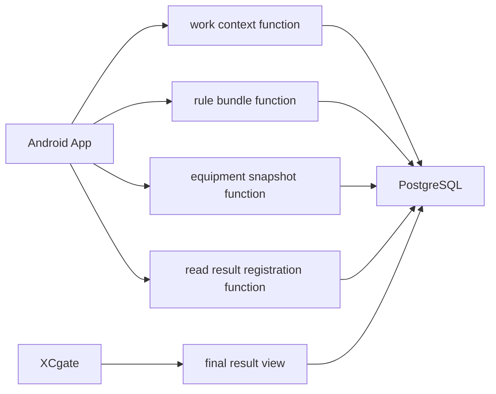

# 06 理想構成提案

## Android 側

- UI / ViewModel は repository だけを見る。
- Repository は work/rule/equipment/result/log を組み合わせる。
- Local judgement は純粋 service に分ける。
- PostgreSQL 低レベル接続は `PostgresGateway` に閉じ込める。

## PostgreSQL 側

- Android 用 View / Function を公開する。
- table は内部実装として扱う。
- 入力検証、制約、冪等性、監査を担う。

## XCgate 側

- final result view を参照する。
- 判定や登録は担当しない。
